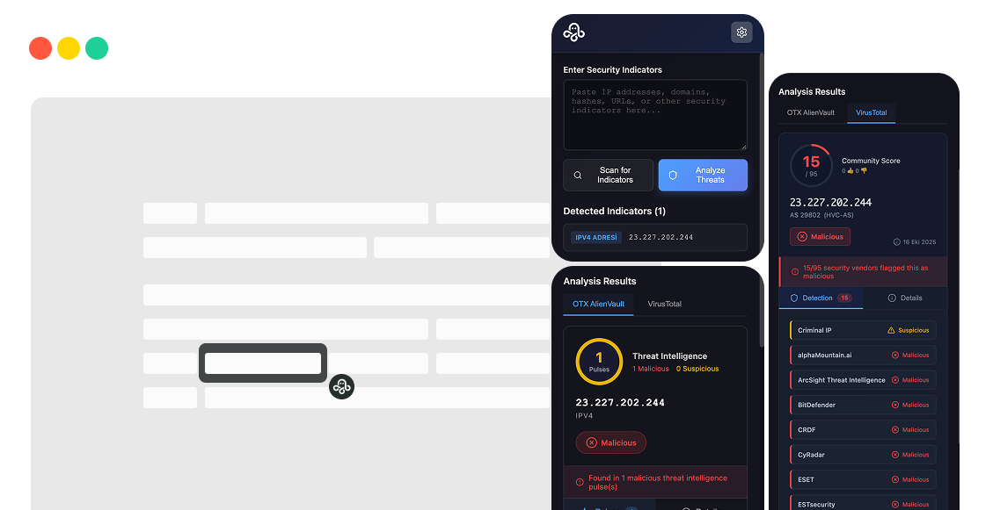

# 🐙 Ahtapot - IOC Analysis Extension

[](https://opensource.org/licenses/MIT)
[](https://ahtapot.me)
[](https://github.com/abdullahcicekli/ahtapot)

> **Fast and secure Indicators of Compromise (IOC) analysis directly in your browser. Built for cybersecurity professionals who need instant threat intelligence.**



## 🎯 Features

- **🔍 Smart Detection** - Automatically detects 11 IOC types including IPs, domains, URLs, hashes, emails, CVEs, and cryptocurrency addresses
- **⚡ Lightning Fast** - One-click analysis with instant results via floating button
- **🛡️ Privacy First** - All API keys stored locally, no tracking, no servers, no data collection
- **📚 Multiple Sources** - Integrates with VirusTotal and AlienVault OTX for comprehensive threat intelligence
- **🔒 Secure Storage** - Uses Chrome's encrypted storage for API keys with optional caching
- **🎨 Modern UI** - Clean design with smooth animations and tab-based results view
- **🌍 Multi-language** - Supports English and Turkish

## 🚀 Installation

### From Chrome Web Store (Recommended)
Coming soon! The extension will be available on the Chrome Web Store.

### Manual Installation (Developer Mode)
1. Clone the repository
   ```bash
   git clone https://github.com/abdullahcicekli/ahtapot.git
   ```
2. Open Chrome and navigate to `chrome://extensions/`
3. Enable "Developer mode" in the top right
4. Click "Load unpacked" and select the extension directory

## 📖 How It Works

1. **Select Text** - Select any text containing IOCs on any webpage
2. **Click Analyze** - A floating button appears instantly - just click it
3. **View Results** - Get detailed threat analysis in a beautiful side panel
4. **Take Action** - Make informed decisions based on threat intelligence

## 🔧 Supported IOC Types

| Type | Example | Description |
|------|---------|-------------|
| **IPv4** | `192.168.1.1` | Internet Protocol version 4 addresses |
| **IPv6** | `2001:0db8::1` | Internet Protocol version 6 addresses |
| **Domain** | `example.com` | Domain names and subdomains |
| **URL** | `https://example.com` | Full web addresses |
| **MD5** | `5d41402abc4b2a76b9719d911017c592` | MD5 hash values |
| **SHA1** | `aaf4c61ddcc5e8a2dabede0f3b482cd9aea9434d` | SHA-1 hash values |
| **SHA256** | `2c26b46b68ffc68ff99b453c1d30413413422d706...` | SHA-256 hash values |
| **Email** | `user@example.com` | Email addresses |
| **CVE** | `CVE-2024-1234` | Common Vulnerabilities and Exposures |
| **Bitcoin** | `1A1zP1eP5QGefi2DMPTfTL5SLmv7DivfNa` | Bitcoin wallet addresses |
| **Ethereum** | `0x742d35Cc6634C0532925a3b844Bc9e7595f0bEb` | Ethereum wallet addresses |

## 🛠️ Configuration

### API Keys Setup
1. Click the extension icon in your browser toolbar
2. Click the settings/gear icon
3. Enter your API keys:
   - **VirusTotal API Key** - Get it from [VirusTotal](https://www.virustotal.com/gui/my-apikey)
   - **AlienVault OTX API Key** - Get it from [AlienVault OTX](https://otx.alienvault.com/api)
4. (Optional) Enable caching to reduce API calls

### Privacy & Security
- All API keys are stored locally using Chrome's encrypted storage
- No data is sent to external servers except the threat intelligence APIs you configure
- No tracking, analytics, or telemetry
- Open source - audit the code yourself!

## 🏗️ Project Structure

```
ahtapot.me/
├── assets/
│   ├── icons/              # Favicon and PWA icons
│   └── images/             # Logos and screenshots
├── index.html              # Landing page
├── manifest.json           # PWA configuration
├── robots.txt              # SEO configuration
├── sitemap.xml             # Site map for search engines
├── CNAME                   # Custom domain configuration
└── README.md               # This file
```

## 🌐 Website

Visit [ahtapot.me](https://ahtapot.me) for:
- Live demo and features overview
- Installation instructions
- Documentation
- Support and feedback

## 📊 Statistics

- **11** IOC Types Supported
- **2** Threat Intelligence Sources
- **100%** Privacy Focused
- **0** Data Collected

## 🤝 Contributing

Contributions are welcome! Please feel free to submit a Pull Request. For major changes, please open an issue first to discuss what you would like to change.

1. Fork the repository
2. Create your feature branch (`git checkout -b feature/AmazingFeature`)
3. Commit your changes (`git commit -m 'Add some AmazingFeature'`)
4. Push to the branch (`git push origin feature/AmazingFeature`)
5. Open a Pull Request

## 📝 License

This project is licensed under the MIT License - see the [LICENSE](https://github.com/abdullahcicekli/ahtapot/blob/main/LICENSE) file for details.

## 🙏 Acknowledgments

- [VirusTotal](https://www.virustotal.com/) - Comprehensive malware analysis service
- [AlienVault OTX](https://otx.alienvault.com/) - Open Threat Exchange platform
- Built with ❤️ for the cybersecurity community

## 📧 Contact & Support

- **Website**: [ahtapot.me](https://ahtapot.me)
- **GitHub**: [@abdullahcicekli](https://github.com/abdullahcicekli)
- **Issues**: [GitHub Issues](https://github.com/abdullahcicekli/ahtapot/issues)

---

<p align="center">Made with ❤️ for the cybersecurity community</p>
